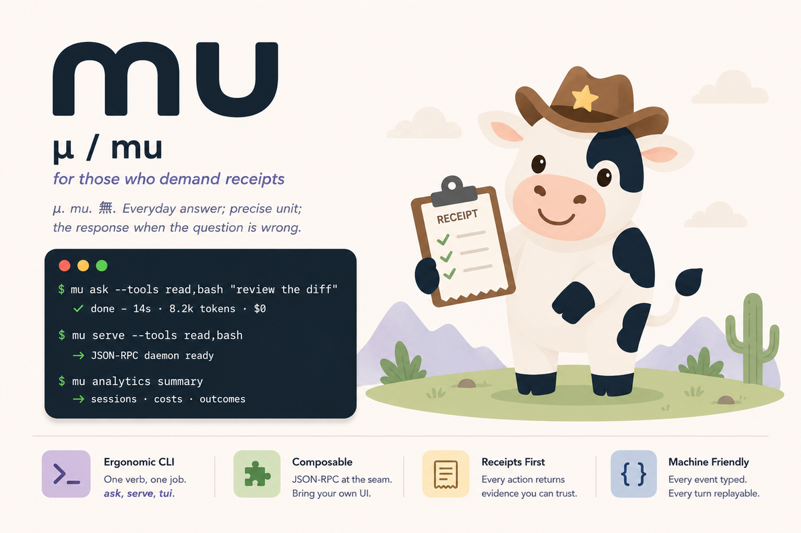
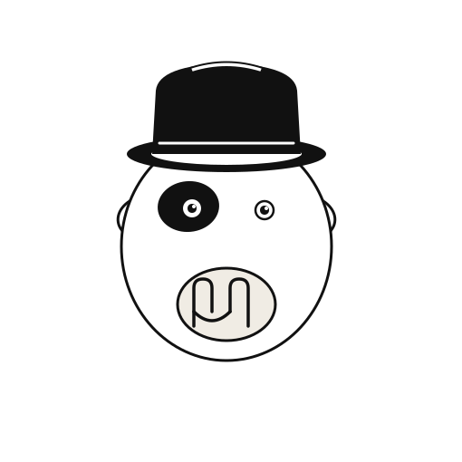
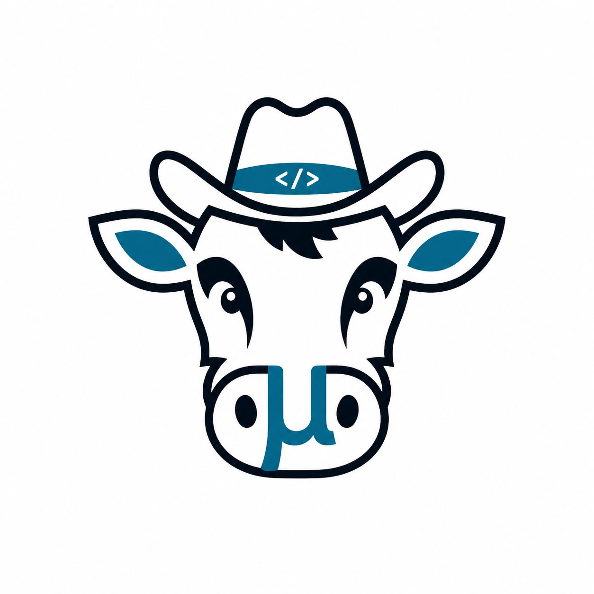
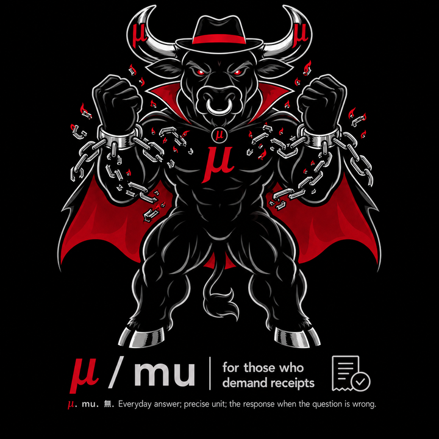
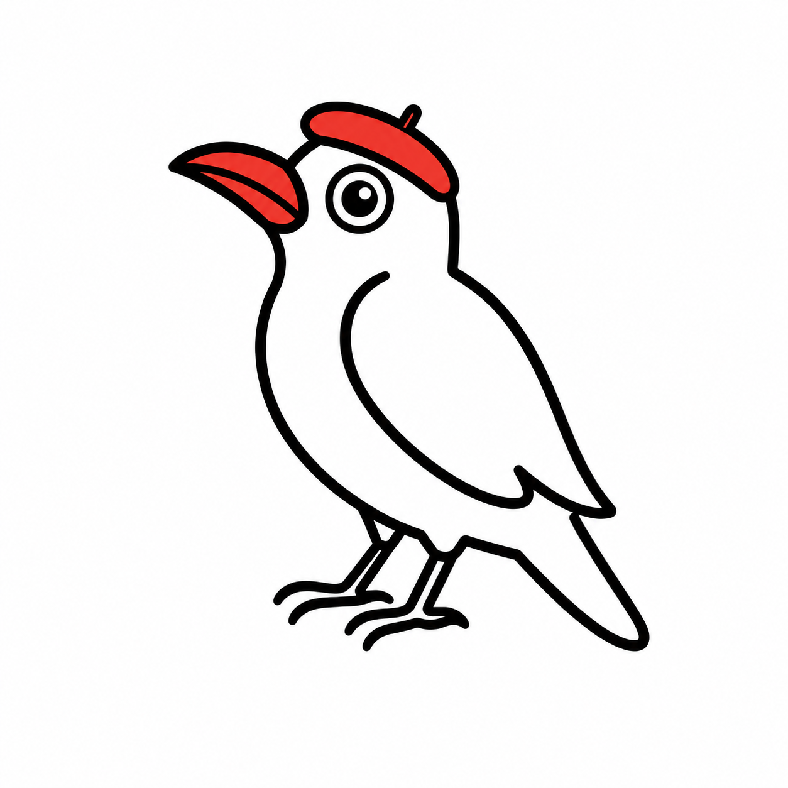

# mu

<p align="center">
  
</p>

`mu` is a receipts-first agent runtime: every session is a durable typed event
log, and every view of the session is a projection of that log.

Claude Code is for when you want to be happy while it codes. `mu` is for when you
want to sleep after it does.

## What mu is

Most coding agents are chat wrapped around tool calls. `mu` is built around a
different center:

> agent work should be inspectable, replayable, accountable, and
> capability-bounded.

A `mu` session is not just a transcript. It is an append-only JSONL event log:
model calls, tool calls, approvals, context assemblies, compaction decisions,
token usage, costs, imported MCP tools, and delegation lineage. The transcript
is one projection. The TUI status bar is another. The analytics database is
another.

When something goes wrong — or surprisingly right — the log answers:

- what did the model see?
- which tools was it allowed to use?
- what did it do?
- what did it cost?
- why did it pause for approval?
- what context was kept, dropped, or compacted?

`mu` is the answer the agent gives when the question's premise is wrong.

## Entry points

One runtime, several frontends:

| Command | Role |
|---|---|
| `mu serve` | JSON-RPC daemon; the protocol/runtime contract |
| `mu-solo` | daily-driver single-pane TUI; spawns its own daemon |
| `mu ask` | one-shot CLI prompts with tool access; scriptable |
| `mu tui` | multi-dashboard inspector for watching a daemon from outside |

The protocol and event model are the contract. Frontends are hats.

<p align="center">
  
</p>

## Status: self-hosting, pre-MVP

`mu` is pre-release and not published to crates.io yet, but it is already used
for its own development. `mu-solo` sessions edit `mu`, search its code through
MCP-imported semantic search, gate shell access through the approval flow, and
leave the resulting work in `mu`'s event log for later inspection.

The architecture is not aspirational. It is the machinery the project is being
built inside.

## Quick start

Build from source:

```sh
git clone https://github.com/sahuagin/mu
cd mu
cargo build --workspace
cargo run -p mu-coding --bin mu -- versions
```

Smoke test with the faux provider, no API key required:

```sh
cargo run -p mu-coding --bin mu -- ask "hello"
# hello
```

Run against Anthropic with tools:

```sh
export ANTHROPIC_API_KEY=...
cargo run -p mu-coding --bin mu -- ask \
  --provider anthropic-api \
  --model claude-haiku-4-5 \
  --tools read \
  "Use the read tool to read /etc/hostname. Just the hostname, nothing else."
```

Run with multiple local tools:

```sh
cargo run -p mu-coding --bin mu -- ask \
  --provider anthropic-api \
  --tools read,ls,grep,glob \
  "Find the Rust crates in this repository and summarize them."
```

Use strict bash with per-call approval:

```sh
cargo run -p mu-coding --bin mu -- ask \
  --provider anthropic-api \
  --tools bash \
  --bash-prompt \
  "Run cargo check and tell me the result."
```

`--bash-yolo` exists for trusted sessions, but it bypasses the strict allowlist
and approval path. Treat it like handing the prompt a shell.

Launch the daily-driver TUI:

```sh
cargo run -p mu-solo --bin mu-solo
```

Or the dashboard client against a running daemon:

```sh
cargo run -p mu-tui -- --mu-binary "$(which mu)" --provider anthropic_api --model claude-haiku-4-5
# or, after `cargo install`:
mu tui
```

## Why event-sourcing matters

`mu` represents context as typed events and retained spans, not as a transcript
blob. That makes context assembly and compaction explainable after the fact.
Every model call records a `ContextAssembly`: which spans entered the prompt,
where they came from, and how many tokens each section consumed.

When compaction runs, `mu` records a `CompactionAssembly`: which spans were kept,
dropped, summarized, or replaced, and why.

That turns "the model forgot something" from a vibe into an audit question.

## Compaction: the concrete payoff

On real `mu` session corpora, structural compaction drops low-value span families
without an LLM call. It keeps tool-call/result/assistant clusters intact and
records the decision audit in the event log.

| Policy | Wall-clock | Cost | Reduction |
|---|---:|---:|---:|
| Anthropic Opus 4.7 auto-compaction baseline | 38.18 s | $2.03 | 124k → 2.3k tokens (~98%) |
| `mu` live Haiku judge policy | 6.0 s | ~$0.16 | 727k → 235k tokens (~67%) |
| `mu` structural drop policy | 62 ms | $0.00 | 727k → 16k tokens (~97%) |

Closest single-session comparison to the Opus baseline: on a 122k-token `mu`
session, the live-Haiku policy ran in **5.12 s** at **~$0.12**, while the
structural-only policy ran in **62 ms** at **$0.00**.

Reproduce locally:

```sh
cargo run --release --example compaction-bench -p mu-ai -- \
  --judge live --max-sessions 20 --format json
```

Measurement notes:

- [`specs/measurements/compaction-2026-05-14.md`](specs/measurements/compaction-2026-05-14.md)
- [`specs/measurements/compaction-2026-05-21.md`](specs/measurements/compaction-2026-05-21.md)

Caveat: `heuristic` is the live serve-path policy today. `hash-and-summary` is
implemented and benchmarked but not yet wired into live session creation
([mu-8bkf]).

## What works today

### Runtime

- stdio JSON-RPC daemon (`mu serve`)
- one-shot CLI (`mu ask`)
- provider abstraction: Anthropic Messages API, OpenRouter, OpenAI Codex OAuth,
  and faux provider for tests
- local tools: `read`, `write`, `ls`, `edit`, `grep`, `glob`, `bash`
- outbound MCP client for importing external tools as first-class capabilities
- native `discover` tool for in-loop capability discovery
- explicit capability gating for every tool call
- approval primitive via `session.input_required`
- OAuth login for providers that need it, with tokens stored under
  `~/.config/mu/auth/` mode `0600`

### Frontends

- `mu-solo`: daily-driver single-pane TUI with scrollback pager, `$EDITOR`
  handoff, slash commands, token/cost metrics, and skills.
- `mu tui`: multi-dashboard ratatui client with session tree, transcript,
  context inspector, raw protocol firehose, provider stats, and approvals queue.

### Observability

- durable typed event logs under `~/.local/share/mu/events/`
- per-call `ContextAssembly` records
- per-compaction `CompactionAssembly` records
- read-only rehydration across daemon restarts
- `mu analytics` projection into SQLite
- live protocol firehose in `mu tui`

## Known gaps

- live session resumption is not implemented yet; rehydrated sessions are
  read-only
- `hash-and-summary` is benchmarked but not yet selectable for live sessions
  ([mu-8bkf])
- `mu orchestrate` is sketched in specs but not implemented
- provider token accounting conventions still need more normalization

## Visual language

<p align="center">
  
  &nbsp;&nbsp;&nbsp;
  
  &nbsp;&nbsp;&nbsp;
  
</p>

The cow is `mu`: the opinionated runtime underneath. The hat is the frontend you
bring and put on top. The daemon cow is for `--yolo`: high-agency, high-risk
mode. The oxpecker picks bugs off `mu`, so it belongs with analytics, audit,
forensics, and review.

Small terminal status indicators should stay textual — e.g. `SAFE` / `YOLO` —
because mascot art collapses at character size. Let the daemon be a startup
stinger, not permanent chrome.

## Workspace shape

```text
crates/
  mu-core/     protocol types, agent loop, event log, transport, tools/providers
  mu-ai/       LLM provider implementations and translation layers
  mu-coding/   the `mu` binary: CLI modes, serve frontend, tools, analytics
  mu-solo/     standalone single-pane TUI
  mu-tui/      multi-dashboard ratatui client
  mu-bridge/   claude-code JSONL → mu event format bridge
  t4c/         tools4claude: intent-based tool discovery surface
```

## Development

A top-level `justfile` collects common workflows:

```sh
just --list
just ci            # fmt-check + clippy + test, matching CI
just check         # ci checks + verify-claims, with timing
just smoke         # mu ask against the faux provider
just pr <branch>   # push current jj @ as <branch> and open a PR
```

Underlying commands:

```sh
cargo build --workspace
cargo check --workspace
cargo nextest run
cargo run -p mu-coding --bin mu -- versions
```

Live provider tests are gated so routine runs do not spend API credits:

```sh
MU_LIVE_ANTHROPIC=1 cargo nextest run -p mu-ai
```

Project specs live under [`specs/`](specs/). Most features are developed from
small specs, with mechanical work sometimes delegated to sub-agents in isolated
jj workspaces under `.delegations/`.

## Architecture deep-dives

- [`specs/architecture/mu-capability-substrate.md`](specs/architecture/mu-capability-substrate.md)
- [`specs/architecture/event-sourced-context.md`](specs/architecture/event-sourced-context.md)
- [`specs/architecture/capability-delegation.md`](specs/architecture/capability-delegation.md)
- [`specs/architecture/os-enforced-agent-sandboxing.md`](specs/architecture/os-enforced-agent-sandboxing.md)
- [`specs/delegations.md`](specs/delegations.md)

## Contributing

`mu` is early. Issues, design notes, and patches are welcome, but the project is
still discovering its core shape.

Before contributing, read:

- [`LICENSE`](LICENSE)
- [`LICENSING.md`](LICENSING.md)
- [`AGENTS.md`](AGENTS.md)
- the relevant spec under [`specs/`](specs/)

If you are building commercial products, hosted agent services, proprietary
agent runtimes, model-training pipelines, or agent-evaluation systems from
`mu`, read the license carefully. Commercial production use requires a separate
commercial license until the delayed-open change date.

## License

`mu` is source-available under a delayed-open license: Business Source License
1.1 with an Additional Use Grant for personal, educational, research,
noncommercial, internal-evaluation, and open-source-project use. This version
converts to BSD-3-Clause on the change date.

See [`LICENSE`](LICENSE) for the controlling terms and [`LICENSING.md`](LICENSING.md)
for the project licensing philosophy.

[mu-8bkf]: https://github.com/sahuagin/mu/issues?q=mu-8bkf
